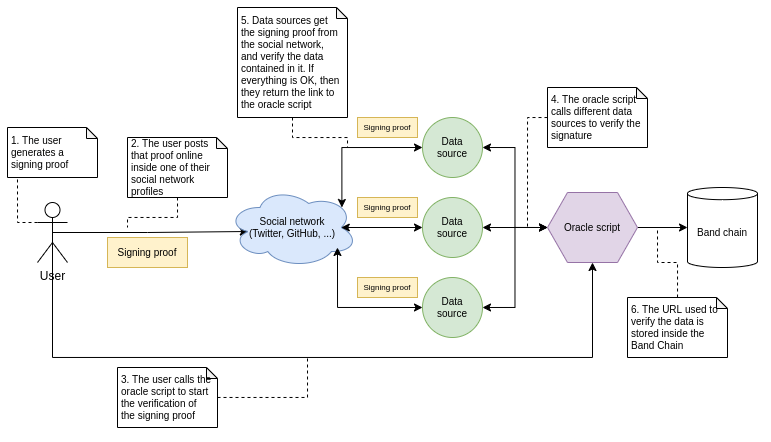

# Themis
> Themis, (Greek: “Order”) in Greek religion, personification of justice, goddess of wisdom and good counsel, and the interpreter of the gods' will.

Themis is a collection of REST APIs, [Band Protocol data sources](https://docs.bandchain.org/whitepaper/terminology.html#data-sources) and [Band Protocol oracle scripts](https://docs.bandchain.org/whitepaper/terminology.html#oracle-scripts) that work together in order to make it possible for [Desmos](https://desmos.network) users to connect their profile to common social network profiles owned by them.

The connection process is defined as follows: 
1. The user signs their social network username with the private key associated with their Desmos profile. 
2. The signature is posted online from the social network account, so that it can be reached publicly (eg. inside a Tweet, a Gist, etc.).
4. Data sources will use our APIs to get that data into the Band chain and verify their correctness (valid signature, and valid address). 
5. Once the data has been verified, the oracle scripts will then store it inside the Band chain as a proof of connection so that it can be later queried and verified. 

At the end of the process, we should have proved with sufficient certainty that: 
1. the user possesses the private key associated to a Desmos profile (as they have been able to sign a message with it); and
2. the same user also possesses access to the social network accounts (as they have been able to post the link using it).

So, we can conclude that the Desmos profile and the social network profile should be connected together. 

## Currently supported social networks
Currently, we support the following social networks:
- [Twitter](.docs/twitter.md)
- [GitHub](.docs/github.md)
- [Discord](.docs/discord.md)

## Process flow
Following you can find the graphical representation of the overall process flow: 

If you want to know more about the individual components, please read the `README.md` files inside each folder.
