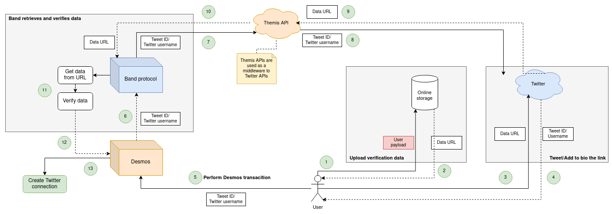

# Twitter
Users can connect their Twitter account by posting a link to the verification data via

- a tweet, if the profile is public;
- the profile biography, even if the profile itself is private. 

In both cases, the verification data must be a JSON object formed as described inside ["Verification data"](data.md).


## Example tweet
An example tweet can be found [here](https://twitter.com/ricmontagnin/status/1368883070590476292). 

## Verification process
The verification process on Twitter is made of the following steps: 


1. The user uploads their verification data to an online storage (eg. PasteBin). 
2. The user links the online storage URL to their account either tweeting it or putting it inside their account description.
3. The user performs a Desmos transaction telling that they want to link the Twitter account to the Desmos one, and provides the proper call data. 

Once that's done, what will happen is the following: 

1. Desmos will send the call data to Band Protocol, asking to get the Twitter username and the signature provided by the user. 
2. Band Protocol will call the appropriate data source that will use our APIs to get the data from either the tweet or the account description. 
3. Once downloaded, the data source will check the validity of the data and return to Desmos the username and signature. 
4. If the Twitter username matches the one provided by the user, and the signature is valid against the user public key, the Desmos and Twitter account will be linked together.  




## Call data
When asking to verify the ownership of a Twitter account, the call data must be a JSON object formed as follows: 

```json
{
  "method": "<Verification method (either tweet or bio)",
  "value": "<Verification value (see below)"
}
```

Example: 
```json
{
  "method":"tweet",
  "value":"1392033585675317252"
}
```

Hex encoded:
```
7B226D6574686F64223A227477656574222C2276616C7565223A2231333932303333353835363735333137323532227D
```

### Verification value
If the `method` is set to `tweet`, the `value` must be a valid public tweet id.

If the `method` is set to `bio`, the `value` must be the Twitter username. 
